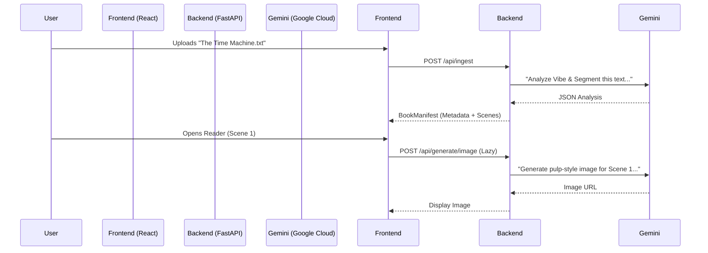

# Project Aether Backend

The "Ingestion Engine" and Generation Proxy for Project Aether. Built with **FastAPI** and **Google Gen AI SDK**.

## Purpose

This service handles the "Heavy Lifting" of the Vibe Coding architecture:
1.  **Ingestion**: Accepts raw text files, uses Gemini 3.0 Flash to analyze "Vibe" (Theme, Audio Profile) and segment the story into scenes.
2.  **Multimodal Generation**: Provides endpoints to lazily generate specific assets (Images via Imagen 3, Audio via Gemini TTS) on demand.

## Setup & Running

### Prerequisites
- Python 3.9+
- A Google Cloud Project with Gemini API enabled.
- `.env` file with `GEMINI_API_KEY`.

### Installation
```bash
cd backend
pip install -r requirements.txt
```

### Running the Server
```bash
uvicorn main:app --reload
```
The server will start at `http://localhost:8000`.

## API Endpoints

### `POST /api/ingest`
- **Input**: Multipart file (`.txt`, `.md`).
- **Process**: 
    - Chunks text.
    - specialized prompt to Gemini Flash for "Vibe Analysis".
    - Returns a `BookManifest` JSON.
- **Output**: JSON object compatible with the Frontend `BookManifest` type.

### `POST /api/generate/image`
- **Input**: `{ book_id, scene_id, prompt }`
- **Process**: Calls Gemini/Imagen 3 to generate a visual representation of the scene.
- **Output**: `{ "url": "..." }` (Returns a signed URL or base64 data).

### `POST /api/generate/audio`
- **Input**: `{ book_id, scene_id, prompt, voice }`
- **Process**: Calls Gemini TTS to generate narrative audio.
- **Output**: `{ "url": "..." }`

## Current Status & Gaps

### State of Development
- [x] Basic Ingestion Pipeline (Text -> JSON)
- [x] CORS configuration for local development
- [x] Lazy Generation Endpoints defined
- [x] Integration with `google-genai` SDK

### Known Gaps & "Hackathon Shortcuts"
1.  **Statelessness**: The backend does not currently use a database (SQL/NoSQL). Uploaded books are processed in-memory and returned to the client. If the browser session is lost, the uploaded book is lost.
    *   *Improvement*: Add SQLite or a simple JSON-file persistence layer.
2.  **Mocked/Placeholder Assets**: To conserve API quota during heavy testing, the `generate_image` and `generate_audio` functions may return placeholder URLs (`picsum.photos`, etc.) if the API key is missing or quota is hit.
3.  **Concurrency**: Large file ingestion is synchronous.
    *   *Improvement*: Implement background tasks (Celery/RQ) for long-form book ingestion.

## Architecture Data Flow


